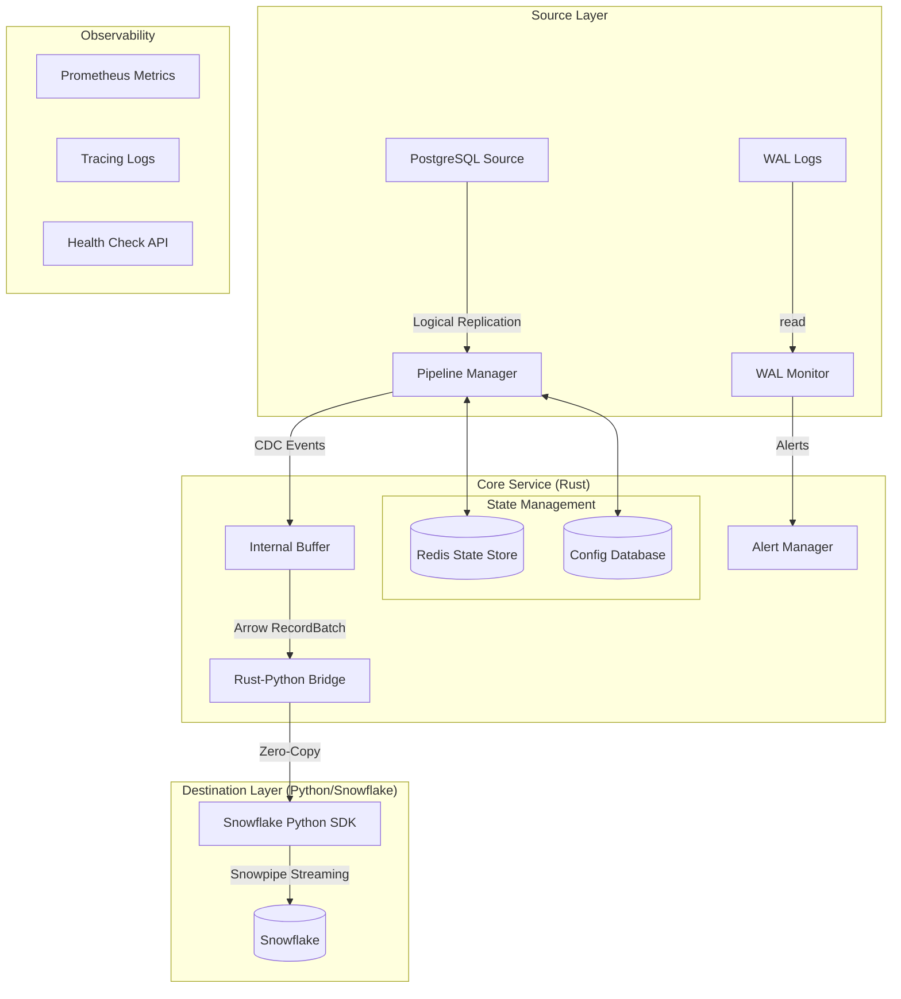

# Architecture Overview

`etl-stream` is a high-performance, resilient ETL (Extract, Transform, Load) system designed to stream data from PostgreSQL sources to Snowflake using Change Data Capture (CDC). It is built primarily in **Rust** for performance and safety, with a **Python** integration layer for utilizing the official Snowflake Snowpipe Streaming SDK.

## High-Level Diagram

## Technology Stack

*   **Core Logic**: Rust (Tokio, SQLx, Tracing)
*   **Data Processing**: Apache Arrow (Zero-Copy data transfer)
*   **Destination integration**: Python (PyO3, Snowflake Connector)
*   **State Management**: Redis (via `deadpool-redis`)
*   **Configuration**: PostgreSQL + Environment Variables
*   **Observability**: Prometheus, Grafana ready

## Key Design Principles

1.  **Performance**:
    *   **Async/Await**: Built on `tokio` for high concurrency.
    *   **Zero-Copy**: Uses Apache Arrow to pass data from Rust to Python without serialization overhead.
    *   **Concurrency**: Pipelines run in parallel; WAL monitoring uses unordered buffering for efficiency.

2.  **Reliability**:
    *   **WAL Monitoring**: Proactively monitors replication slots to prevent disk space exhaustion.
    *   **Circuit Breaking**: Automatically pauses ingestion if Snowflake becomes unresponsive.
    *   **Self-Healing**: Automatically creates missing tables in Snowflake.

3.  **Maintainability**:
    *   **Modular Architecture**: Clear separation between Source, Pipeline, and Destination layers.
    *   **Config Driven**: Pipelines are defined in a database, allowing dynamic additions without redeployment.
